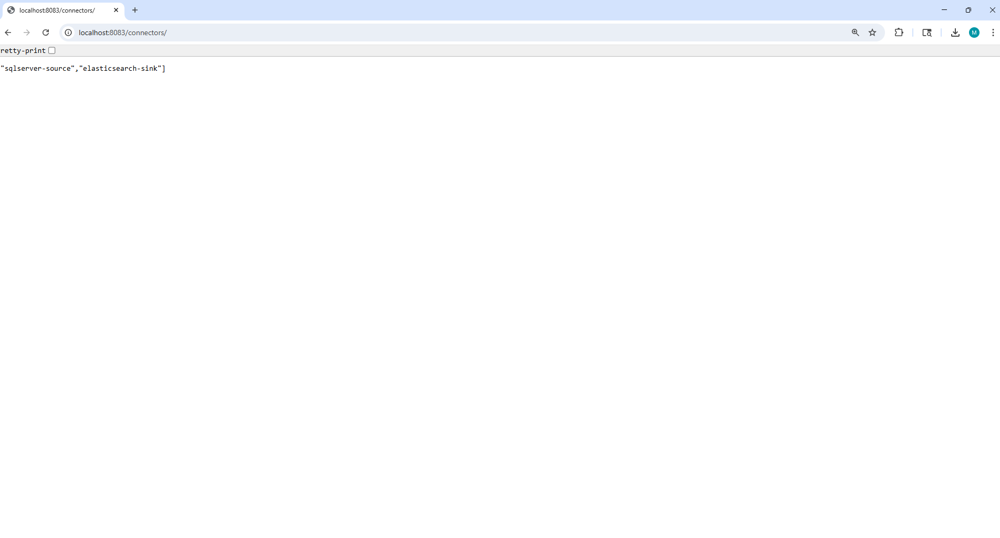
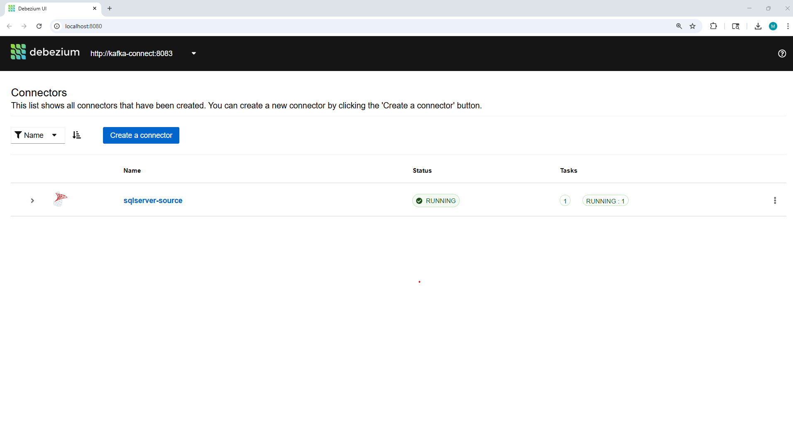
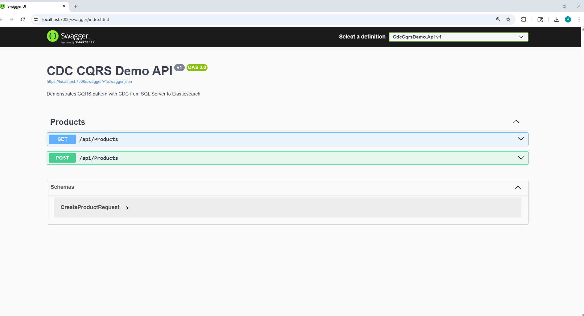
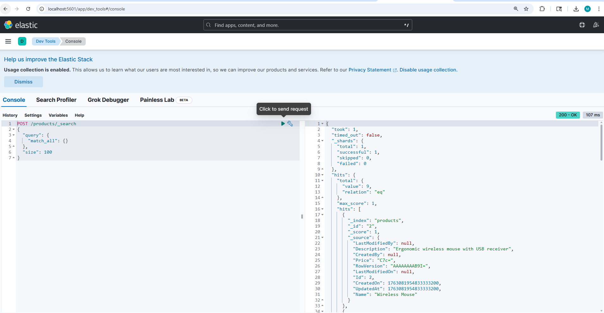

# CQRS Beyond the Database: CDC-Based Architecture with .NET, Sql Server, Debezium, Kafka, and Elasticsearch

Demo of implementing Command Query Responsibility Segregation (CQRS) at the infrastructure level using Change Data Capture (CDC) to achieve true read/write separation. This design pattern enables independent scaling of read and write workloads while maintaining eventual consistency through event streaming.

## Design Philosophy

This demonstration implements CQRS (Command Query Responsibility Segregation) at the infrastructure level using Change Data Capture (CDC) and event streaming. The architecture achieves read/write separation by automatically capturing database changes through CDC, streaming them via Kafka, and maintaining eventual consistency between the write database (SQL Server) and read database (Elasticsearch).

**Core Concepts:**

- **CQRS**: Commands write to SQL Server, queries read from Elasticsearch - complete separation of read and write models
- **Change Data Capture (CDC)**: Database-level change capture eliminates the need for application-level event publishing
- **Event Streaming**: Changes flow through Kafka as a durable, scalable event stream
- **Eventual Consistency**: Acceptable delay between write and read operations enables independent optimization and scaling
- **Infrastructure-Level Separation**: CQRS boundaries exist at the database layer, not in application code

This architectural pattern is detailed in the design blog post: [Moving CQRS Beyond the Database: System Design with Debezium, Kafka, and Elasticsearch](https://medium.com/@mohd2sh/moving-cqrs-beyond-the-database-system-design-with-debezium-kafka-and-elasticsearch-2e2b425a5fcb)

## Design Overview

The system implements CQRS by separating write operations (commands) and read operations (queries) at the database level, with an event streaming pipeline maintaining eventual consistency between the two models.


### Data Flow

1. **Command Execution**: Write operations are handled by command handlers that persist data to SQL Server
2. **CDC Capture**: SQL Server Change Data Capture automatically captures all database changes at the transaction log level
3. **Event Streaming**: Debezium connector reads CDC logs and publishes change events to Kafka topics
4. **Event Processing**: Kafka streams events to consumers that transform and index data in Elasticsearch
5. **Query Execution**: Read operations (GET) query Elasticsearch, which is optimized for search and analytics

This design demonstrates **eventual consistency**: changes written to SQL Server appear in Elasticsearch through the CDC pipeline, without requiring application-level event publishing.

## Design Principles

### Command Query Responsibility Segregation (CQRS)

Commands and queries are separated at both the application and infrastructure levels:

- **Commands**: Modify state, write to SQL Server (ACID transactions), return minimal data
- **Queries**: Never modify state, read from Elasticsearch (optimized for search), return DTOs

This separation enables independent optimization: SQL Server handles transactional writes with strong consistency guarantees, while Elasticsearch provides fast, scalable read operations with full-text search capabilities.

### Change Data Capture (CDC)

CDC eliminates the need for application-level event publishing by capturing all database changes automatically:

- **Zero Application Impact**: No code changes required to capture events
- **Complete Coverage**: All database changes are captured, including direct SQL modifications
- **Low Latency**: Changes are captured at the transaction log level with minimal overhead
- **Reliability**: Database-level capture ensures no events are missed

### Eventual Consistency

The system accepts a small delay between write and read operations in exchange for:

- **Independent Scaling**: Read and write databases scale independently
- **Performance Optimization**: Each database is optimized for its workload
- **Resilience**: Write database issues don't affect read operations
- **Flexibility**: Different data models and schemas for reads and writes

## Technology Stack

### Application Layer
- **.NET 8**: Web API framework with CQRS pattern implementation

### Write Database
- **SQL Server 2019**: Transactional database with built-in CDC support
- **Note**: The architecture is database-agnostic. PostgreSQL, MySQL, or other databases with CDC support can be used with appropriate Debezium connectors

### CDC and Event Streaming
- **Debezium**: CDC connector framework that reads database transaction logs
- **Apache Kafka**: Distributed event streaming platform for reliable message delivery
- **Kafka Connect**: Framework for building and running connectors between Kafka and external systems
  - **Note**: Kafka Connect connectors are Java-based. For teams preferring other languages or requiring more control, custom worker services can be developed in any language (e.g., .NET, Python, Go) that consume directly from Kafka topics

### Read Database
- **Elasticsearch**: Distributed search and analytics engine optimized for read operations
- **Kibana**: Visualization and management interface for Elasticsearch

### Infrastructure (Demo Only)
- **Docker Compose**: Container orchestration for local development and demonstration
- **Aiven Elasticsearch Sink Connector**: Open-source Kafka Connect sink connector (used for POC demonstration)

## Production Considerations

### Infrastructure Management

**Important**: The Docker Compose configuration in this repository is intended for demonstration and local development only. Production deployments require proper infrastructure management:

- **Infrastructure as Code**: Use Terraform, Pulumi, CloudFormation, or similar tools to manage infrastructure
- **Container Orchestration**: Deploy to Kubernetes, Docker Swarm, or managed container services.
- **Configuration Management**: Implement proper secrets management, environment-specific configurations, and CI/CD pipelines
- **Monitoring and Observability**: Deploy comprehensive logging, metrics collection (Prometheus, Datadog), and distributed tracing.
- **High Availability**: Design for multi-region deployments, failover scenarios, and disaster recovery
- **Security**: Implement network isolation, TLS encryption, authentication, and authorization

### Elasticsearch Indexing Strategy

The demonstration uses the Aiven Elasticsearch Sink Connector (Java-based, as required by Kafka Connect) for simplicity. Production environments should consider:

1. **Commercial Connectors**: Enterprise-grade connectors (e.g., Confluent Elasticsearch Sink Connector) offer better support, monitoring, and production features. These remain Java-based due to Kafka Connect's architecture.

2. **Custom Worker Services**: Dedicated worker services can be developed in any language (.NET, Python, Go, Node.js, etc.) that consume directly from Kafka topics, providing:
   - Language flexibility: Use your team's preferred technology stack
   - Full control over message processing and transformation logic
   - Custom error handling, retry mechanisms, and dead-letter queues
   - Schema evolution and data migration strategies
   - Type-safe data structures and validation
   - Better observability and debugging capabilities
   - Horizontal scaling through Kafka consumer groups

The choice between Java-based Kafka Connect connectors and custom workers depends on specific requirements, team expertise, operational constraints, and performance needs. Custom workers eliminate the Java dependency and provide greater flexibility for teams working primarily in other languages.

### Database Flexibility

While this demonstration uses SQL Server, the architecture supports any database with CDC capabilities:

- **PostgreSQL**
- **MySQL**
- **MongoDB**

The CDC pipeline and event streaming layer remain unchanged regardless of the source database, demonstrating the flexibility of infrastructure-level CQRS.

## Related Projects

This project uses NuGet packages from the [CleanArchitecture-DDD-CQRS](https://github.com/mohd2sh/CleanArchitecture-DDD-CQRS) repository for CQRS abstractions, DDD patterns, and repository interfaces:
- `Mohd2sh.CleanArchitecture.Core.Application`
- `Mohd2sh.CleanArchitecture.Core.Domain`
- `Mohd2sh.CleanArchitecture.Core.Infrastructure`

The infrastructure-level CDC design demonstrated here can be applied to the CleanArchitecture-DDD-CQRS template. That template provides:
- Domain-Driven Design patterns and bounded contexts
- Clean Architecture boundaries with automated architecture tests
- Error management system
- Integration event patterns
- Outbox pattern for guaranteed event delivery
- Cross-aggregate coordination through domain events

Combining the CleanArchitecture-DDD-CQRS application structure with this infrastructure-level CDC approach provides a complete solution: application-level CQRS with DDD patterns, plus infrastructure-level read/write separation through CDC streaming.

## Getting Started

### Prerequisites

- Docker Desktop (for local infrastructure)
- .NET 8 SDK

### Quick Start

1. **Start Infrastructure Services**
   ```bash
   docker-compose up -d
   ```
   This starts all required services (SQL Server, Kafka, Zookeeper, Kafka Connect, Elasticsearch, Kibana) with proper health checks and dependency ordering. Wait 3-4 minutes for all services to become healthy.

2. **Verify Connector Registration**
   ```bash
   curl http://localhost:8083/connectors
   ```
   Should return: `["sqlserver-source","elasticsearch-sink"]`
   
   
   *Kafka Connect showing both connectors registered and running*
   
   Alternatively, open Debezium UI: http://localhost:8080
   
   
   *Debezium UI showing SQL Server source connector status*

3. **Run the Application**
   ```bash
   cd src/CdcCqrsDemo.Api
   dotnet run
   ```

4. **Access the API**
   - Swagger UI: https://localhost:7000/swagger
   - Health Check: https://localhost:7000/health
   
   
   *Swagger UI showing available API endpoints*

### Observing the Architecture

The following scenario demonstrates the CDC pipeline in action, showing how data flows from SQL Server to Elasticsearch:

**Step 1: Get All Products (Initial State)**

*Initial state showing existing products in Elasticsearch*

**Step 2: Create a New Product**

*Creating a new product via POST request - data is written to SQL Server*

**Step 3: Verify Product Appears (After CDC Sync)**

*After small delay, the new product appears in Elasticsearch via the CDC pipeline*

This demonstrates **eventual consistency**: the write operation completes immediately in SQL Server, but the read operation reflects the change after the CDC pipeline (Debezium → Kafka → Elasticsearch Sink Connector) processes the event.

### Monitoring Tools

- **Debezium UI**: http://localhost:8080 - Monitor CDC connector status and lag
- **Kibana**: http://localhost:5601 - Explore Elasticsearch indices and data
  
  
  *Kibana Dev Tools showing Elasticsearch queries and indexed data*
  
- **Kafka Connect API**: http://localhost:8083 - Manage connectors and view status

## Project Structure

```
SqlServer.CdcToElastic/
├── docker-compose.yml              # Infrastructure orchestration (demo only)
├── infrastructure/
│   ├── docker/
│   │   └── Dockerfile.kafka-connect    # Custom Kafka Connect image with Debezium
│   ├── database/
│   │   └── init.sql                    # Database schema and CDC initialization
│   ├── connectors/
│   │   ├── sqlserver-source-connector.json    # Debezium source connector configuration
│   │   └── elasticsearch-sink-connector.json  # Elasticsearch sink connector configuration
│   ├── scripts/
│   │   └── setup-connectors.sh         # Connector registration script
│   └── plugins/
│       └── kafka-connect/              # Elasticsearch connector plugin
└── src/
    └── CdcCqrsDemo.Api/            # .NET 8 Web API
        ├── Domain/                  # Domain entities
        ├── Commands/                # Write operations (CQRS)
        ├── Queries/                 # Read operations (CQRS)
        ├── Controllers/              # REST API endpoints
        └── Services/                # Elasticsearch integration
```

## Key Concepts Demonstrated

1. **Infrastructure-Level CQRS**: Read/write separation achieved through CDC and event streaming, not application code
2. **Change Data Capture**: Automatic capture of all database changes without application modifications
3. **Event Streaming**: Reliable message delivery and processing through Kafka
4. **Eventual Consistency**: Acceptable delay between write and read operations for improved scalability
5. **Polyglot Persistence**: Different databases optimized for different workloads (SQL Server for writes, Elasticsearch for reads)
6. **Technology Agnosticism**: CDC pipeline works with any application framework or language


## Give a Star

If this project helped you understand infrastructure-level CQRS patterns or inspired your architectural designs, please consider giving it a star. Your support helps others discover this approach to implementing CQRS beyond the database.

## License

This is a demonstration project for educational and design exploration purposes.
